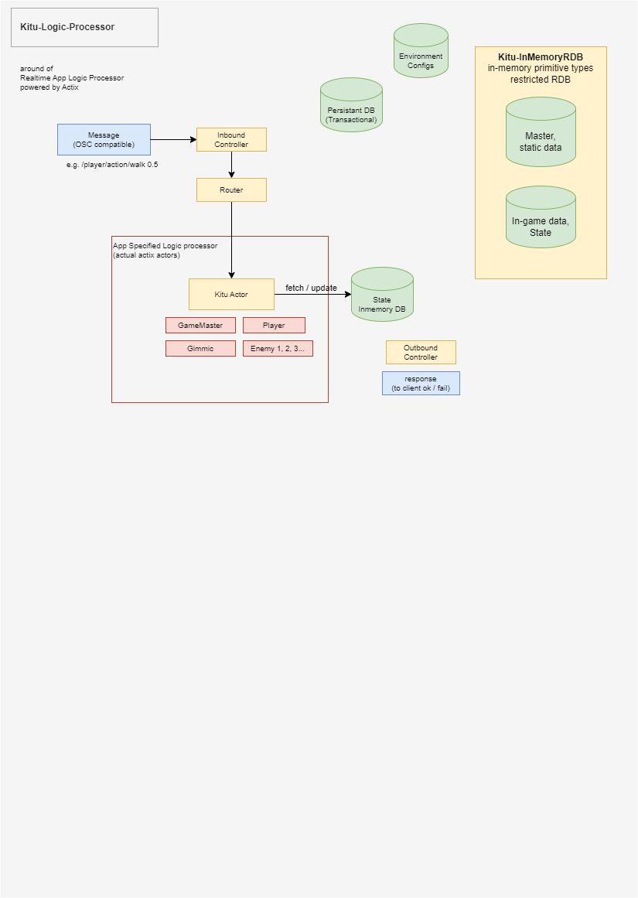

*this repository has nothing to work in real so far. now still in designing*

# Kitu
OSS powered framework, that aims to answer for production features to development game application.

## Concept and features
Kitu is comprehensive framework that integration of multiple repositories. but these are build for Kitu implementation, based on concept below.

- don't do everything on editor (Unity Editor, others) - Scripting backend + Headless client archtecture  
  development with 2 systems: *headless frontend*, and *BFF* (Scripting Backend For Frontend, term from webdev but it's wide meaning) makes isolate cosmetic logic and game system logic.
- on-the-fly editing: keeps play mode while development iteration (as much as possible). reduces to annoying repeat recompile and reload time.

## Ecosystem

